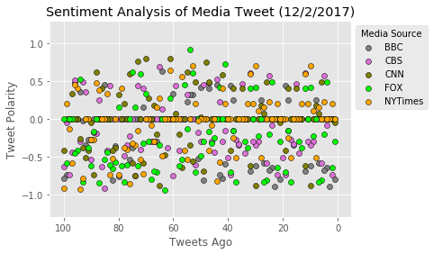
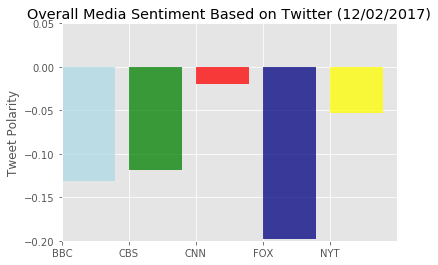

```python
# Dependencies
import tweepy
import numpy as np
import pandas as pd
from datetime import datetime
import matplotlib.pyplot as plt
from matplotlib import style
style.use('ggplot')

# Import and Initialize Sentiment Analyzer
from vaderSentiment.vaderSentiment import SentimentIntensityAnalyzer
analyzer = SentimentIntensityAnalyzer()

# Twitter API Keys
from config import (consumer_key, 
                    consumer_secret, 
                    access_token, 
                    access_token_secret)

# Setup Tweepy API Authentication
auth = tweepy.OAuthHandler(consumer_key, consumer_secret)
auth.set_access_token(access_token, access_token_secret)
api = tweepy.API(auth, parser=tweepy.parsers.JSONParser())
```


```python
# Target Account
target_user1= "@BBCNews"

# Counter
counter = 1

# Variables for holding sentiments
sentiments1 = []


# Loop through 5 pages of tweets (total 100 tweets)
for x in range(5):

    # Get user's tweets
    public_tweets1 = api.user_timeline(target_user1, page=x)
    # Loop through all tweets 
    for tweet in public_tweets1:
        
        # Run Vader Analysis on each tweet
        compound = analyzer.polarity_scores(tweet["text"])["compound"]
        pos = analyzer.polarity_scores(tweet["text"])["pos"]
        neu = analyzer.polarity_scores(tweet["text"])["neu"]
        neg = analyzer.polarity_scores(tweet["text"])["neg"]
        tweets_ago=counter
        
        # Add sentiments for each tweet into an array (as a dictionary)
        sentiments1.append({"Data": tweet["created_at"],
                           "Compound": compound,
                           "positive": pos,
                           "negative": neg,
                           "neutral": neu,
                           "tweets_ago": counter})
        
        # Add to counter 
        counter=counter+1
```


```python
target_user2= "@CBSNews"

# Counter
counter = 1

# Variables for holding sentiments
sentiments2 = []


# Loop through 5 pages of tweets (total 100 tweets)
for x in range(5):

    # Get user's tweets
    public_tweets2 = api.user_timeline(target_user2, page=x)
    
    for tweet in public_tweets2:
        
        # Run Vader Analysis on each tweet
        compound = analyzer.polarity_scores(tweet["text"])["compound"]
        pos = analyzer.polarity_scores(tweet["text"])["pos"]
        neu = analyzer.polarity_scores(tweet["text"])["neu"]
        neg = analyzer.polarity_scores(tweet["text"])["neg"]
        tweets_ago=counter
        
        # Add sentiments for each tweet into an array (as a dictionary)
        sentiments2.append({"Data": tweet["created_at"],
                           "Compound": compound,
                           "positive": pos,
                           "negative": neg,
                           "neutral": neu,
                           "tweets_ago": counter})
        
        # Add to counter 
        counter=counter+1

```


```python
target_user3= "@CNN"
# Counter
counter = 1

# Variables for holding sentiments
sentiments3 = []


# Loop through 5 pages of tweets (total 100 tweets)
for x in range(5):

    # Get user's tweets
    public_tweets3 = api.user_timeline(target_user3, page=x)
    
    for tweet in public_tweets3:
        
        # Run Vader Analysis on each tweet
        compound = analyzer.polarity_scores(tweet["text"])["compound"]
        pos = analyzer.polarity_scores(tweet["text"])["pos"]
        neu = analyzer.polarity_scores(tweet["text"])["neu"]
        neg = analyzer.polarity_scores(tweet["text"])["neg"]
        tweets_ago=counter
        
        # Add sentiments for each tweet into an array (as a dictionary)
        sentiments3.append({"Data": tweet["created_at"],
                           "Compound": compound,
                           "positive": pos,
                           "negative": neg,
                           "neutral": neu,
                           "tweets_ago": counter})
        
        # Add to counter 
        counter=counter+1

```


```python
target_user4= "@FoxNews"  
# Counter
counter = 1

# Variables for holding sentiments
sentiments4 = []


# Loop through 5 pages of tweets (total 100 tweets)
for x in range(5):

    # Get user's tweets
    public_tweets4 = api.user_timeline(target_user4, page=x)
    for tweet in public_tweets4:
        
        # Run Vader Analysis on each tweet
        compound = analyzer.polarity_scores(tweet["text"])["compound"]
        pos = analyzer.polarity_scores(tweet["text"])["pos"]
        neu = analyzer.polarity_scores(tweet["text"])["neu"]
        neg = analyzer.polarity_scores(tweet["text"])["neg"]
        tweets_ago=counter
        
        # Add sentiments for each tweet into an array (as a dictionary)
        sentiments4.append({"Data": tweet["created_at"],
                           "Compound": compound,
                           "positive": pos,
                           "negative": neg,
                           "neutral": neu,
                           "tweets_ago": counter})
        
        # Add to counter 
        counter=counter+1
```


```python
# Target Account
target_user5= "@nytimes"

# Counter
counter = 1

# Variables for holding sentiments
sentiments5 = []


# Loop through 5 pages of tweets (total 100 tweets)
for x in range(5):

    # Get user's tweets
    public_tweets5 = api.user_timeline(target_user5, page=x)
    for tweet in public_tweets5:
        
        # Run Vader Analysis on each tweet
        compound = analyzer.polarity_scores(tweet["text"])["compound"]
        pos = analyzer.polarity_scores(tweet["text"])["pos"]
        neu = analyzer.polarity_scores(tweet["text"])["neu"]
        neg = analyzer.polarity_scores(tweet["text"])["neg"]
        tweets_ago=counter
        
        # Add sentiments for each tweet into an array (as a dictionary)
        sentiments5.append({"Data": tweet["created_at"],
                           "Compound": compound,
                           "positive": pos,
                           "negative": neg,
                           "neutral": neu,
                           "tweets_ago": counter})
        
        # Add to counter 
        counter=counter+1
```


```python
sentiments1_pd=pd.DataFrame(sentiments1)
sentiments1_pd.head()

```


<div>
<style>
    .dataframe thead tr:only-child th {
        text-align: right;
    }

    .dataframe thead th {
        text-align: left;
    }

    .dataframe tbody tr th {
        vertical-align: top;
    }
</style>
<table border="1" class="dataframe">
  <thead>
    <tr style="text-align: right;">
      <th></th>
      <th>Compound</th>
      <th>Data</th>
      <th>negative</th>
      <th>neutral</th>
      <th>positive</th>
      <th>tweets_ago</th>
    </tr>
  </thead>
  <tbody>
    <tr>
      <th>0</th>
      <td>-0.8020</td>
      <td>Sat Dec 02 05:40:17 +0000 2017</td>
      <td>0.419</td>
      <td>0.581</td>
      <td>0.0</td>
      <td>1</td>
    </tr>
    <tr>
      <th>1</th>
      <td>0.0000</td>
      <td>Sat Dec 02 04:52:33 +0000 2017</td>
      <td>0.000</td>
      <td>1.000</td>
      <td>0.0</td>
      <td>2</td>
    </tr>
    <tr>
      <th>2</th>
      <td>-0.9001</td>
      <td>Sat Dec 02 02:36:05 +0000 2017</td>
      <td>0.647</td>
      <td>0.353</td>
      <td>0.0</td>
      <td>3</td>
    </tr>
    <tr>
      <th>3</th>
      <td>-0.6486</td>
      <td>Sat Dec 02 02:22:06 +0000 2017</td>
      <td>0.301</td>
      <td>0.699</td>
      <td>0.0</td>
      <td>4</td>
    </tr>
    <tr>
      <th>4</th>
      <td>-0.6808</td>
      <td>Sat Dec 02 01:20:51 +0000 2017</td>
      <td>0.365</td>
      <td>0.635</td>
      <td>0.0</td>
      <td>5</td>
    </tr>
  </tbody>
</table>
</div>


```python
sentiments2_pd=pd.DataFrame(sentiments2)
sentiments2_pd.head()

```


<div>
<style>
    .dataframe thead tr:only-child th {
        text-align: right;
    }

    .dataframe thead th {
        text-align: left;
    }

    .dataframe tbody tr th {
        vertical-align: top;
    }
</style>
<table border="1" class="dataframe">
  <thead>
    <tr style="text-align: right;">
      <th></th>
      <th>Compound</th>
      <th>Data</th>
      <th>negative</th>
      <th>neutral</th>
      <th>positive</th>
      <th>tweets_ago</th>
    </tr>
  </thead>
  <tbody>
    <tr>
      <th>0</th>
      <td>0.0000</td>
      <td>Sat Dec 02 06:03:06 +0000 2017</td>
      <td>0.000</td>
      <td>1.000</td>
      <td>0.000</td>
      <td>1</td>
    </tr>
    <tr>
      <th>1</th>
      <td>-0.7351</td>
      <td>Sat Dec 02 05:48:05 +0000 2017</td>
      <td>0.323</td>
      <td>0.677</td>
      <td>0.000</td>
      <td>2</td>
    </tr>
    <tr>
      <th>2</th>
      <td>0.0000</td>
      <td>Sat Dec 02 05:33:05 +0000 2017</td>
      <td>0.000</td>
      <td>1.000</td>
      <td>0.000</td>
      <td>3</td>
    </tr>
    <tr>
      <th>3</th>
      <td>-0.0772</td>
      <td>Sat Dec 02 05:18:07 +0000 2017</td>
      <td>0.080</td>
      <td>0.920</td>
      <td>0.000</td>
      <td>4</td>
    </tr>
    <tr>
      <th>4</th>
      <td>0.5719</td>
      <td>Sat Dec 02 05:03:07 +0000 2017</td>
      <td>0.000</td>
      <td>0.802</td>
      <td>0.198</td>
      <td>5</td>
    </tr>
  </tbody>
</table>
</div>


```python
sentiments3_pd=pd.DataFrame(sentiments3)
sentiments3_pd.head()
```


<div>
<style>
    .dataframe thead tr:only-child th {
        text-align: right;
    }

    .dataframe thead th {
        text-align: left;
    }

    .dataframe tbody tr th {
        vertical-align: top;
    }
</style>
<table border="1" class="dataframe">
  <thead>
    <tr style="text-align: right;">
      <th></th>
      <th>Compound</th>
      <th>Data</th>
      <th>negative</th>
      <th>neutral</th>
      <th>positive</th>
      <th>tweets_ago</th>
    </tr>
  </thead>
  <tbody>
    <tr>
      <th>0</th>
      <td>-0.0516</td>
      <td>Sat Dec 02 06:00:18 +0000 2017</td>
      <td>0.124</td>
      <td>0.762</td>
      <td>0.114</td>
      <td>1</td>
    </tr>
    <tr>
      <th>1</th>
      <td>0.0000</td>
      <td>Sat Dec 02 05:30:06 +0000 2017</td>
      <td>0.000</td>
      <td>1.000</td>
      <td>0.000</td>
      <td>2</td>
    </tr>
    <tr>
      <th>2</th>
      <td>0.0000</td>
      <td>Sat Dec 02 05:20:17 +0000 2017</td>
      <td>0.000</td>
      <td>1.000</td>
      <td>0.000</td>
      <td>3</td>
    </tr>
    <tr>
      <th>3</th>
      <td>0.0000</td>
      <td>Sat Dec 02 05:02:41 +0000 2017</td>
      <td>0.000</td>
      <td>1.000</td>
      <td>0.000</td>
      <td>4</td>
    </tr>
    <tr>
      <th>4</th>
      <td>0.0000</td>
      <td>Sat Dec 02 04:30:07 +0000 2017</td>
      <td>0.000</td>
      <td>1.000</td>
      <td>0.000</td>
      <td>5</td>
    </tr>
  </tbody>
</table>
</div>


```python
sentiments4_pd=pd.DataFrame(sentiments4)
sentiments4_pd.head()
```


<div>
<style>
    .dataframe thead tr:only-child th {
        text-align: right;
    }

    .dataframe thead th {
        text-align: left;
    }

    .dataframe tbody tr th {
        vertical-align: top;
    }
</style>
<table border="1" class="dataframe">
  <thead>
    <tr style="text-align: right;">
      <th></th>
      <th>Compound</th>
      <th>Data</th>
      <th>negative</th>
      <th>neutral</th>
      <th>positive</th>
      <th>tweets_ago</th>
    </tr>
  </thead>
  <tbody>
    <tr>
      <th>0</th>
      <td>-0.2960</td>
      <td>Sat Dec 02 06:00:00 +0000 2017</td>
      <td>0.155</td>
      <td>0.845</td>
      <td>0.000</td>
      <td>1</td>
    </tr>
    <tr>
      <th>1</th>
      <td>-0.6486</td>
      <td>Sat Dec 02 05:46:08 +0000 2017</td>
      <td>0.301</td>
      <td>0.699</td>
      <td>0.000</td>
      <td>2</td>
    </tr>
    <tr>
      <th>2</th>
      <td>0.0000</td>
      <td>Sat Dec 02 05:30:00 +0000 2017</td>
      <td>0.000</td>
      <td>1.000</td>
      <td>0.000</td>
      <td>3</td>
    </tr>
    <tr>
      <th>3</th>
      <td>0.4939</td>
      <td>Sat Dec 02 05:00:01 +0000 2017</td>
      <td>0.000</td>
      <td>0.775</td>
      <td>0.225</td>
      <td>4</td>
    </tr>
    <tr>
      <th>4</th>
      <td>-0.2023</td>
      <td>Sat Dec 02 04:38:27 +0000 2017</td>
      <td>0.153</td>
      <td>0.847</td>
      <td>0.000</td>
      <td>5</td>
    </tr>
  </tbody>
</table>
</div>


```python
sentiments5_pd=pd.DataFrame(sentiments5)
sentiments5_pd.head()
```


<div>
<style>
    .dataframe thead tr:only-child th {
        text-align: right;
    }

    .dataframe thead th {
        text-align: left;
    }

    .dataframe tbody tr th {
        vertical-align: top;
    }
</style>
<table border="1" class="dataframe">
  <thead>
    <tr style="text-align: right;">
      <th></th>
      <th>Compound</th>
      <th>Data</th>
      <th>negative</th>
      <th>neutral</th>
      <th>positive</th>
      <th>tweets_ago</th>
    </tr>
  </thead>
  <tbody>
    <tr>
      <th>0</th>
      <td>0.0000</td>
      <td>Sat Dec 02 06:06:03 +0000 2017</td>
      <td>0.0</td>
      <td>1.000</td>
      <td>0.000</td>
      <td>1</td>
    </tr>
    <tr>
      <th>1</th>
      <td>0.2023</td>
      <td>Sat Dec 02 05:52:08 +0000 2017</td>
      <td>0.0</td>
      <td>0.899</td>
      <td>0.101</td>
      <td>2</td>
    </tr>
    <tr>
      <th>2</th>
      <td>0.0000</td>
      <td>Sat Dec 02 05:34:03 +0000 2017</td>
      <td>0.0</td>
      <td>1.000</td>
      <td>0.000</td>
      <td>3</td>
    </tr>
    <tr>
      <th>3</th>
      <td>0.0000</td>
      <td>Sat Dec 02 05:32:05 +0000 2017</td>
      <td>0.0</td>
      <td>1.000</td>
      <td>0.000</td>
      <td>4</td>
    </tr>
    <tr>
      <th>4</th>
      <td>0.2263</td>
      <td>Sat Dec 02 05:19:13 +0000 2017</td>
      <td>0.0</td>
      <td>0.913</td>
      <td>0.087</td>
      <td>5</td>
    </tr>
  </tbody>
</table>
</div>


```python
plt.scatter(sentiments1_pd["tweets_ago"], sentiments1_pd["Compound"], marker="o",color='grey', edgecolor='black',label="BBC")
plt.scatter(sentiments2_pd["tweets_ago"], sentiments2_pd["Compound"], marker="o",color='orchid',edgecolor='black',label="CBS")
plt.scatter(sentiments3_pd["tweets_ago"], sentiments3_pd["Compound"], marker="o",color='olive',edgecolor='black',label="CNN")
plt.scatter(sentiments4_pd["tweets_ago"], sentiments4_pd["Compound"], marker="o",color='lime',edgecolor='black',label="FOX")
plt.scatter(sentiments5_pd["tweets_ago"], sentiments5_pd["Compound"], marker="o",color='orange',edgecolor='black',label="NYTimes")

# Incorporate the other graph properties
plt.title("Sentiment Analysis of Media Tweet (12/2/2017)")
plt.ylabel("Tweet Polarity")
plt.xlabel("Tweets Ago")
plt.grid(True)
plt.ylim([-1.3, 1.3])
plt.xlim([105, -5])
lgnd = plt.legend(bbox_to_anchor=(1,1), loc="best",
                  ncol=1, title="Media Source",
                  labelspacing=0.5)

# Save the figure
plt.savefig("Sentiment_Analysis_of_Media_Tweet")

# Show plot
plt.show()
```





```python
BBC=np.mean(sentiments1_pd["Compound"])
CBS=np.mean(sentiments2_pd["Compound"])
CNN=np.mean(sentiments3_pd["Compound"])
FOX=np.mean(sentiments4_pd["Compound"])
NYT=np.mean(sentiments5_pd["Compound"])
```


```python
x_axis= ('BBC', 'CBS', 'CNN', 'FOX', 'NYT')
y_axis= np.arange(len(x_axis))
#performance = [0.05,0.00,-0.05,-0.10,-0.15,-0.20]
#plt.bar(y_pos, performance, align='center', alpha=0.5)
plt.bar(0, BBC, align='edge', alpha=0.75,facecolor="lightblue")
plt.bar(1, CBS, align='edge', alpha=0.75,facecolor="green")
plt.bar(2, CNN, align='edge', alpha=0.75,facecolor="red")
plt.bar(3, FOX, align='edge', alpha=0.75,facecolor="navy")
plt.bar(4, NYT, align='edge', alpha=0.75,facecolor="yellow")
plt.xticks(y_axis, x_axis)

plt.title("Overall Media Sentiment Based on Twitter (12/02/2017)")
plt.ylabel("Tweet Polarity")
plt.ylim([-0.20, 0.05])
plt.xlim(0, len(x_axis))
plt.savefig("Overall_Media_Sentiment")
plt.show()
```




